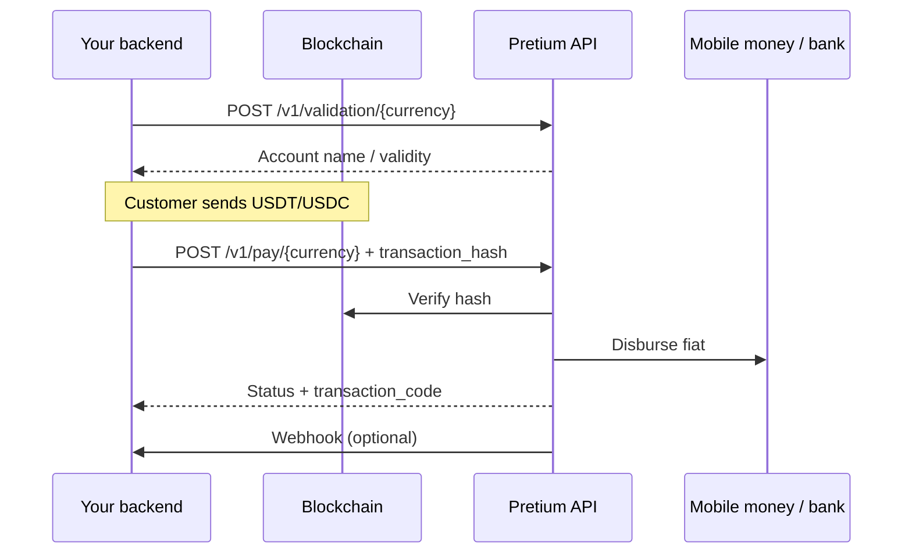

Offramp uses the unified `/v1` API: verify an on-chain transfer, then disburse to mobile money or bank accounts.

## Flow



## Steps

1. **Validate** the destination with [`POST /v1/validation/{currency_code}`](/api-reference/payments/validation).
2. **Quote** with [`POST /v1/exchange-rate`](/api-reference/rates/exchange-rate) or v2 for ramp locks.
3. Customer (or your treasury) sends stablecoins to our settlement address on a supported network.
4. Call [`POST /v1/pay/{currency_code}`](/api-reference/payments/pay) with `transaction_hash` and payout fields.
5. Poll [`POST /v1/status/{currency_code}`](/api-reference/payments/status) or handle [webhooks](/webhooks).

## Supported networks (pay)

`BASE`, `CELO` (default), `STELLAR`, `POLYGON`, `SOLANA`, `ETHEREUM`, `BNB`, `AVALANCHE`, `ARBITRUM`

## Amount limits (pay)

Per-transaction min/max by currency and mobile money network: [Limits](/limits).

## Example (KES mobile)

```bash
curl -X POST "{{base_url}}/v1/pay/KES" \
  -H "x-api-key: YOUR_CONSUMER_KEY" \
  -H "Content-Type: application/json" \
  -d '{
    "transaction_hash": "0xabc...",
    "chain": "CELO",
    "type": "MOBILE",
    "shortcode": "254712345678",
    "amount": 1000,
    "mobile_network": "Safaricom",
    "callback_url": "https://example.com/hooks/pretium"
  }'
```

Reuse of the same `transaction_hash` is rejected once it has been processed.
